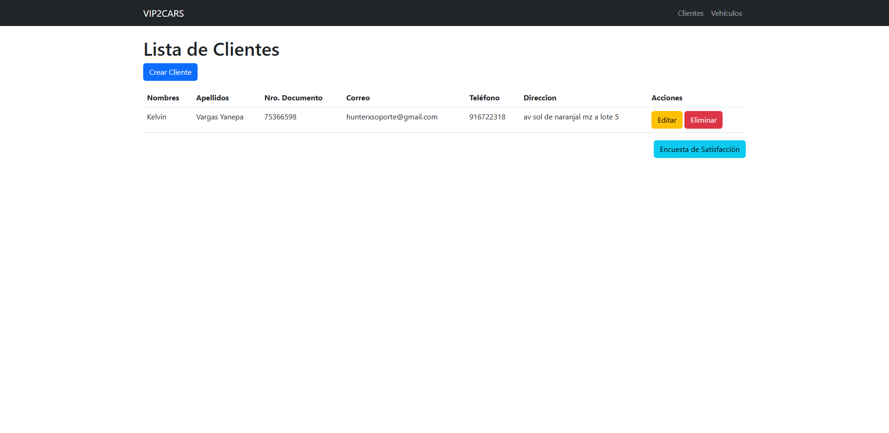
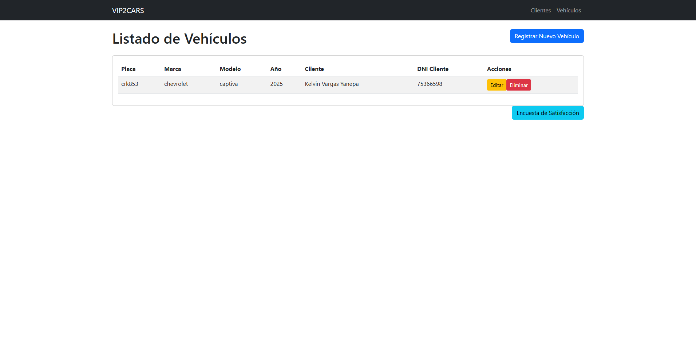
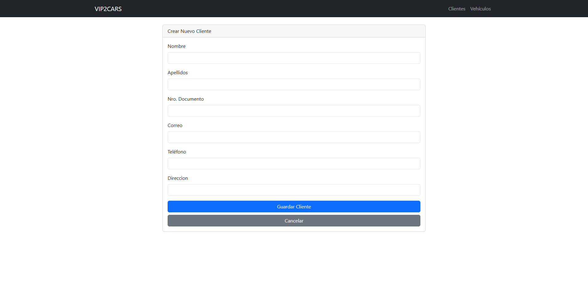
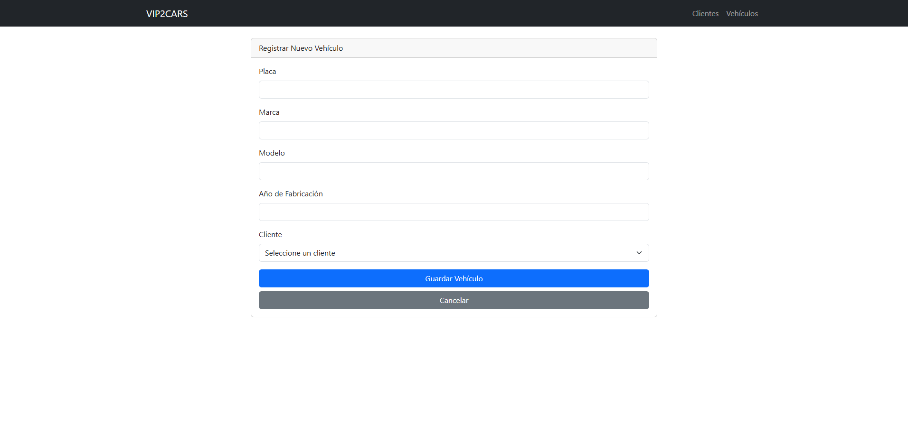
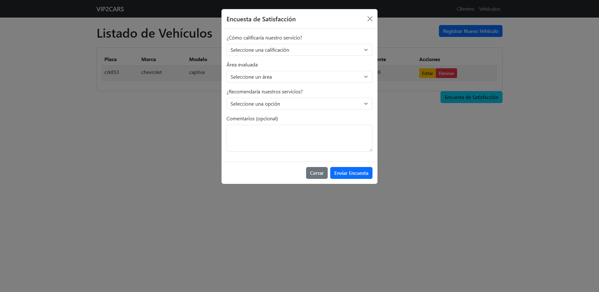

# VIP2CARS

Sistema web desarrollado en Laravel para la gestión de vehículos y clientes, orientado al rubro automotriz.  
Incluye un módulo de encuestas anónimas de satisfacción para mejorar la experiencia del usuario.

## Características principales

- CRUD de vehículos y clientes.
- Relación entre vehículos y sus propietarios.
- Encuestas anónimas de satisfacción integradas en la interfaz.
- Interfaz responsive y amigable.
- Código estructurado y buenas prácticas de desarrollo.

## Tecnologías

- PHP 8 / Laravel
- Bootstrap 5
- MySQL

---

> Proyecto realizado como prueba técnica

## Capturas de pantalla

### PáginaS

### PáginaS

### Modal de encuesta

